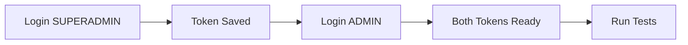

# OrionTek Customer Management System

<div align="center">
  

  <p><em>Sistema completo de gestión de clientes con autenticación JWT y arquitectura moderna</em></p>

  <p>
    <a href="https://customer-management-frontend-lreo.vercel.app/" target="_blank">
      
    </a>
    <a href="https://customer-management-production-f510.up.railway.app/swagger-ui/index.html" target="_blank">
      
    </a>
    <a href="https://github.com/criseulises/customer-management-frontend" target="_blank">
      
    </a>
  </p>

  <p>
    
    
    
    
    
    
    
    
  </p>
</div>

---

## Descripción del Proyecto

El **OrionTek Customer Management System** es una aplicación completa de gestión de clientes desarrollada como proyecto técnico, que demuestra las mejores prácticas en desarrollo de software empresarial moderno. El sistema implementa una arquitectura robusta con separación clara de responsabilidades, autenticación segura y una interfaz de usuario intuitiva.

### 🏢 Contexto Empresarial
La aplicación simula un entorno empresarial real donde diferentes tipos de administradores manejan carteras de clientes con niveles de acceso diferenciados, implementando las mejores prácticas de seguridad y usabilidad.

---

## Características Principales

### 🔐 Sistema de Autenticación y Autorización
- **JWT Authentication** con tokens de 24 horas de duración
- **Roles granulares**: `SUPERADMIN` y `ADMIN` con permisos específicos
- **Stateless security** para escalabilidad horizontal
- **Refresh automático** de sesiones con validación en tiempo real
- **Auditoría completa** de intentos de login y accesos

### 👥 Gestión de Usuarios
- **CRUD completo** de usuarios (solo SUPERADMIN)
- **Creación de administradores** con roles específicos
- **Búsqueda avanzada** por nombre, apellido y email
- **Activación/desactivación** de cuentas
- **Estadísticas en tiempo real** de usuarios del sistema
- **Soft delete** para mantener integridad referencial

### 👤 Gestión de Clientes
- **CRUD completo** con validaciones robustas
- **Múltiples direcciones** por cliente (casa, trabajo, facturación, envío)
- **Búsqueda inteligente** en todos los campos relevantes
- **Paginación optimizada** para grandes volúmenes de datos
- **Filtrado por creador** (ADMIN ve solo sus clientes)
- **Estadísticas detalladas** por usuario y globales
- **Soft delete** con posibilidad de reactivación

### 🏢 Gestión de Direcciones
- **Tipos diferenciados**: HOME, WORK, BILLING, SHIPPING, OTHER
- **Dirección principal** automática por cliente
- **Validación de unicidad** para direcciones primarias
- **Formato internacional** compatible
- **Geocodificación preparada** para futuras integraciones

### 📊 Reporting y Analytics
- **Dashboard de estadísticas** en tiempo real
- **Métricas por usuario** y globales
- **Contadores dinámicos** de clientes activos/inactivos
- **Reportes de actividad** de administradores
- **Logs de auditoría** completos

### 🛡️ Seguridad Avanzada
- **CORS configurado** para múltiples orígenes
- **Rate limiting** preparado para implementar
- **Validación de entrada** en múltiples capas
- **Sanitización automática** de datos
- **Headers de seguridad** configurados

---

## Despliegue y Enlaces Importantes

### 🌐 Aplicaciones en Producción

<div align="center">

| Servicio | URL | Descripción |
|----------|-----|-------------|
| 🖥️ **Frontend** | [customer-management-frontend-lreo.vercel.app](https://customer-management-frontend-lreo.vercel.app/) | Interfaz de usuario React desplegada en Vercel |
| 🔧 **API Backend** | [customer-management-production-f510.up.railway.app](https://customer-management-production-f510.up.railway.app) | API REST desplegada en Railway |
| 📚 **Documentación API** | [Swagger UI](https://customer-management-production-f510.up.railway.app/swagger-ui/index.html) | Documentación interactiva OpenAPI |

</div>

### 📁 Repositorios y Recursos

<div align="center">

| Recurso | URL | Descripción |
|---------|-----|-------------|
| 🎨 **Frontend Repository** | [customer-management-frontend](https://github.com/criseulises/customer-management-frontend) | Código fuente React con TypeScript |
| 📮 **Postman Collection** | [API Collection](https://github.com/criseulises/customer-management/blob/main/src/main/resources/postman/OrionTek%20Customer%20Management%20API.postman_collection.json) | Tests automatizados y ejemplos |
| 🌍 **Postman Environment** | [Development Environment](https://github.com/criseulises/customer-management/blob/main/src/main/resources/postman/Customer%20Management%20-%20Development.postman_environment.json) | Variables de entorno para testing |

</div>

### ☁️ Infraestructura de Despliegue

#### Backend (Railway)
- **Base de datos**: MySQL 8.0 en Railway
- **Contenedor**: Docker con Java 21 Alpine
- **CI/CD**: Despliegue automático desde GitHub
- **Escalabilidad**: Auto-scaling configurado
- **Monitoreo**: Logs centralizados y métricas

#### Frontend (Vercel)
- **Framework**: React 18 con TypeScript
- **Build**: Optimización automática y CDN global
- **SSL**: Certificados automáticos
- **Preview**: Deployments automáticos por PR

---

## 🛠️ Tech Stack

### 🔧 Backend Technologies

<div align="center">

| Categoría | Tecnología | Versión | Propósito |
|-----------|------------|---------|-----------|
| **Core** | Java | 21 LTS | Lenguaje principal con características modernas |
| **Framework** | Spring Boot | 3.5.3 | Framework web y configuración automática |
| **Security** | Spring Security | 6.x | Autenticación y autorización |
| **Authentication** | JWT (jjwt) | 0.12.3 | Tokens stateless seguros |
| **Persistence** | Spring Data JPA | 3.x | ORM y repositorios automáticos |
| **ORM** | Hibernate | 6.x | Mapeo objeto-relacional |
| **Database** | MySQL | 8.0 | Base de datos relacional |
| **Connection Pool** | HikariCP | 5.x | Pool de conexiones optimizado |
| **Validation** | Jakarta Validation | 3.x | Validación de DTOs |
| **Documentation** | springdoc-openapi | 2.2.0 | Generación automática de API docs |
| **Build Tool** | Maven | 3.9+ | Gestión de dependencias y build |
| **Container** | Docker | Latest | Contenerización y despliegue |

</div>

### 🎨 Frontend Technologies

<div align="center">

| Categoría | Tecnología | Versión | Propósito |
|-----------|------------|---------|-----------|
| **Core** | React | 18.x | Biblioteca de UI |
| **Language** | TypeScript | 5.x | Tipado estático |
| **Styling** | Tailwind CSS | 3.x | Framework de utilidades CSS |
| **State Management** | Context API | Built-in | Gestión de estado global |
| **HTTP Client** | Axios | 1.x | Cliente HTTP con interceptors |
| **Routing** | React Router | 6.x | Navegación SPA |
| **Forms** | React Hook Form | 7.x | Formularios optimizados |
| **Icons** | Lucide React | Latest | Iconografía moderna |
| **Build Tool** | Vite | 5.x | Build tool rápido |

</div>

### 🔧 Development & DevOps

<div align="center">

| Categoría | Tecnología | Propósito |
|-----------|------------|-----------|
| **Version Control** | Git + GitHub | Control de versiones y colaboración |
| **Testing** | Postman + Newman | Testing de API automatizado |
| **API Documentation** | OpenAPI 3.0 | Especificación estándar de APIs |
| **Deployment** | Railway + Vercel | Plataformas cloud nativas |
| **Monitoring** | SLF4J + Logback | Logging estructurado |
| **Security** | HTTPS + CORS | Comunicación segura |

</div>

---

## Estructura del Proyecto

```
customer-management/
├── 📁 src/
│   ├── 📁 main/
│   │   ├── 📁 java/com/oriontek/customermanagement/
│   │   │   ├── 📁 config/                    # ⚙️ Configuraciones
│   │   │   │   ├── 📄 DataInitializer.java   # Datos iniciales por entorno
│   │   │   │   ├── 📄 SecurityConfig.java    # Configuración de seguridad
│   │   │   │   └── 📄 SwaggerConfig.java     # Documentación API
│   │   │   │
│   │   │   ├── 📁 controller/                # 🎮 Controladores REST
│   │   │   │   ├── 📄 AuthController.java    # Endpoints de autenticación
│   │   │   │   ├── 📄 UserController.java    # Gestión de usuarios (SUPERADMIN)
│   │   │   │   └── 📄 CustomerController.java # Gestión de clientes
│   │   │   │
│   │   │   ├── 📁 dto/                       # 📋 Data Transfer Objects
│   │   │   │   ├── 📁 request/               # DTOs de entrada
│   │   │   │   │   ├── 📄 LoginRequest.java
│   │   │   │   │   ├── 📄 CreateUserRequest.java
│   │   │   │   │   ├── 📄 UpdateUserRequest.java
│   │   │   │   │   ├── 📄 CreateCustomerRequest.java
│   │   │   │   │   └── 📄 CreateAddressRequest.java
│   │   │   │   └── 📁 response/              # DTOs de salida
│   │   │   │       ├── 📄 AuthResponse.java
│   │   │   │       ├── 📄 LoginResponse.java
│   │   │   │       ├── 📄 UserResponse.java
│   │   │   │       ├── 📄 CustomerResponse.java
│   │   │   │       └── 📄 AddressResponse.java
│   │   │   │
│   │   │   ├── 📁 entity/                    # 🗃️ Entidades JPA
│   │   │   │   ├── 📄 User.java              # Usuario con roles y UserDetails
│   │   │   │   ├── 📄 Customer.java          # Cliente con auditoría
│   │   │   │   └── 📄 Address.java           # Direcciones múltiples
│   │   │   │
│   │   │   ├── 📁 enums/                     # 📝 Enumeraciones
│   │   │   │   ├── 📄 Role.java              # SUPERADMIN, ADMIN
│   │   │   │   └── 📄 AddressType.java       # HOME, WORK, BILLING, etc.
│   │   │   │
│   │   │   ├── 📁 repository/                # 💾 Repositorios Spring Data
│   │   │   │   ├── 📄 UserRepository.java    # Queries de usuarios
│   │   │   │   ├── 📄 CustomerRepository.java # Queries de clientes + búsqueda
│   │   │   │   └── 📄 AddressRepository.java # Queries de direcciones
│   │   │   │
│   │   │   ├── 📁 security/                  # 🔒 Componentes de seguridad
│   │   │   │   ├── 📄 JwtService.java        # Generación y validación JWT
│   │   │   │   └── 📄 JwtAuthenticationFilter.java # Filtro de autenticación
│   │   │   │
│   │   │   ├── 📁 service/                   # 🏢 Lógica de negocio
│   │   │   │   ├── 📄 AuthService.java       # Autenticación y tokens
│   │   │   │   ├── 📄 UserService.java       # CRUD usuarios (SUPERADMIN)
│   │   │   │   ├── 📄 CustomerService.java   # CRUD clientes con permisos
│   │   │   │   └── 📄 CustomUserDetailsService.java # Carga usuarios para Security
│   │   │   │
│   │   │   └── 📄 CustomerManagementApplication.java # 🚀 Clase principal
│   │   │
│   │   └── 📁 resources/
│   │       ├── 📄 application.yml            # ⚙️ Configuración principal
│   │       ├── 📄 application-development.yml # 🛠️ Config desarrollo
│   │       ├── 📄 application-production.yml  # 🌐 Config producción
│   │       └── 📁 postman/                   # 📮 Colecciones de testing
│   │           ├── 📄 OrionTek Customer Management API.postman_collection.json
│   │           └── 📄 Customer Management - Development.postman_environment.json
│   │
│   └── 📁 test/                              # 🧪 Tests (estructura preparada)
│       └── 📁 java/com/oriontek/customermanagement/
│
├── 📄 pom.xml                                # 📦 Dependencias Maven
├── 📄 Dockerfile                             # 🐳 Configuración Docker
├── 📄 .gitignore                             # 🚫 Archivos excluidos
└── 📄 README.md                              # 📖 Documentación
```

---

# 🏗️ Arquitectura del Sistema - OrionTek Customer Management


### **Layered Architecture (N-Tier)**
Separación clara en capas con responsabilidades específicas:

```
┌─────────────────────────────────────┐
│        PRESENTATION LAYER           │  ← Controllers, DTOs, HTTP Handling
│  @RestController, @RequestMapping   │
└─────────────────────────────────────┘
                    ↓
┌─────────────────────────────────────┐
│         BUSINESS LAYER              │  ← Services, Business Logic
│         @Service, @Transactional    │
└─────────────────────────────────────┘
                    ↓
┌─────────────────────────────────────┐
│       DATA ACCESS LAYER            │  ← Repositories, Data Access
│     @Repository, JpaRepository      │
└─────────────────────────────────────┘
                    ↓
┌─────────────────────────────────────┐
│         DATA LAYER                  │  ← Entities, Database
│  @Entity, JPA/Hibernate, MySQL     │
└─────────────────────────────────────┘
```

---

## 🔄 Patrones de Diseño Implementados

### **Patrones Estructurales**

#### 🎯 **Model-View-Controller (MVC)**
#### 🗃️ **Repository Pattern**
#### 📋 **DTO Pattern (Data Transfer Object)**
#### 🏢 **Service Layer Pattern**

### **JWT Stateless Authentication**

```
┌─────────────┐    JWT Token    ┌─────────────┐    Validate    ┌─────────────┐
│   Client    │ ──────────────→ │ JWT Filter  │ ──────────────→ │ JWT Service │
└─────────────┘                 └─────────────┘                 └─────────────┘
                                        │                              │
                                        ▼                              ▼
                                ┌─────────────┐    Load User   ┌─────────────┐
                                │Security     │ ──────────────→ │ UserDetails │
                                │Context      │                 │ Service     │
                                └─────────────┘                 └─────────────┘
```

### **Security Layers**

#### 🛡️ **Authentication Layer**
#### 🔒 **Authorization Layer**
#### 🔍 **Security Filters**

---

## 📮 Configuración de Postman para Testing

### 🚀 Setup Inicial

#### 1. **Descargar Recursos**
```bash
# Clonar repositorio
git clone https://github.com/criseulises/customer-management.git
cd customer-management/src/main/resources/postman/
```

#### 2. **Importar en Postman**

**Paso a paso:**

1. **Abrir Postman Desktop** o Web
2. **Importar Colección**:
   - Clic en **"Import"** (esquina superior izquierda)
   - **"Upload files"** o **"Raw text"**
   - Seleccionar: `OrionTek Customer Management API.postman_collection.json`
   - Clic **"Import"**

3. **Importar Environment**:
   - Clic en **"Environments"** (sidebar izquierdo)
   - **"Import"**
   - Seleccionar: `Customer Management - Development.postman_environment.json`
   - Clic **"Import"**

4. **Seleccionar Environment**:
   - Dropdown superior derecho
   - Seleccionar: **"Customer Management - Development"**

### ⚙️ Variables de Entorno Configuradas

```json
{
  "base_url": "http://localhost:8080",
  "superadmin_email": "superadmin@oriontek.com",
  "superadmin_password": "SuperAdmin123!",
  "admin_email": "admin@oriontek.com", 
  "admin_password": "Admin123!",
  "superadmin_token": "",  // Se llena automáticamente
  "admin_token": "",       // Se llena automáticamente
  "created_user_id": "",   // Para tests encadenados
  "created_customer_id": "" // Para tests encadenados
}
```

### 🔄 Flujo de Testing Automatizado

#### **1. Authentication Flow**


#### **2. Orden de Ejecución Recomendado**

```
1. 🔐 Authentication
   ├── Login SUPERADMIN
   ├── Login ADMIN  
   ├── Validate Token
   └── Current User Info

2. 👥 User Management (SUPERADMIN Only)
   ├── Create User ADMIN
   ├── List All Users
   ├── Get User by ID
   ├── Update User
   ├── Search Users
   ├── User Statistics
   └── Deactivate/Activate User

3. 👤 Customer Management (ADMIN + SUPERADMIN)
   ├── Create Customer (ADMIN)
   ├── Create Customer (SUPERADMIN)
   ├── List Customers (Role-based)
   ├── Get Customer by ID
   ├── Search Customers
   ├── Customer Statistics
   └── Deactivate/Activate Customer

4. 🛡️ Security Tests
   ├── Access without Token
   ├── Invalid Token
   ├── ADMIN accessing User Management
   └── Role Segregation Tests

5. ✅ Validation Tests
   ├── Invalid Email Format
   ├── Missing Required Fields
   ├── Duplicate Email
   └── Business Rule Violations
```

---

## ⚡ Quick Start en Local

### 📋 Prerrequisitos

```bash
# Verificar versiones
java --version    # >= 21
mvn --version     # >= 3.8
docker --version  # Latest (opcional)
git --version     # Latest
```

### 🔧 Instalación y Configuración

#### **1. Clonar y Navegar**
```bash
git clone https://github.com/criseulises/customer-management.git
cd customer-management
```

#### **2. Configuración de Base de Datos**

**Opción A: MySQL Local**
```bash
# Instalar MySQL
sudo apt install mysql-server  # Ubuntu/Debian
brew install mysql             # macOS

# Crear base de datos
mysql -u root -p
CREATE DATABASE customer_management;
CREATE USER 'cm_user'@'localhost' IDENTIFIED BY 'cm_password';
GRANT ALL PRIVILEGES ON customer_management.* TO 'cm_user'@'localhost';
FLUSH PRIVILEGES;
EXIT;
```

**Opción B: Docker MySQL**
```bash
# Ejecutar MySQL en container
docker run --name mysql-cm \
  -e MYSQL_ROOT_PASSWORD=rootpassword \
  -e MYSQL_DATABASE=customer_management \
  -e MYSQL_USER=cm_user \
  -e MYSQL_PASSWORD=cm_password \
  -p 3306:3306 \
  -d mysql:8.0
```

**Opción C: H2 Database (Desarrollo rápido)**
```yaml
# En application-development.yml (ya configurado)
spring:
  datasource:
    url: jdbc:h2:mem:testdb
    # Sin configuración adicional necesaria
```

#### **3. Variables de Entorno**

**Crear archivo `.env` (no incluir en VCS):**
```bash
# Base de datos
MYSQL_HOST=localhost
MYSQL_PORT=3306
MYSQL_DATABASE=customer_management
MYSQL_USER=cm_user
MYSQL_PASSWORD=cm_password

# JWT Configuration
JWT_SECRET=bXlTZWNyZXRLZXkxMjNAI0ZvcjIwMjRBcHBsaWNhdGlvbkpXVFNlY3VyaXR5
JWT_EXPIRATION=86400000

# App Configuration
APP_ENVIRONMENT=development
DDL_AUTO=update
LOG_LEVEL=DEBUG

# CORS (para desarrollo)
CORS_ALLOWED_ORIGINS=http://localhost:3000,http://localhost:4200

# Default Users
DEFAULT_SUPERADMIN_EMAIL=superadmin@oriontek.com
DEFAULT_SUPERADMIN_PASSWORD=SuperAdmin123!
DEFAULT_ADMIN_EMAIL=admin@oriontek.com
DEFAULT_ADMIN_PASSWORD=Admin123!
```

**Exportar variables (Linux/macOS):**
```bash
export MYSQL_HOST=localhost
export MYSQL_PORT=3306
export MYSQL_DATABASE=customer_management
export MYSQL_USER=cm_user
export MYSQL_PASSWORD=cm_password
export JWT_SECRET=bXlTZWNyZXRLZXkxMjNAI0ZvcjIwMjRBcHBsaWNhdGlvbkpXVFNlY3VyaXR5
export JWT_EXPIRATION=86400000
export APP_ENVIRONMENT=development
```

#### **4. Compilación y Ejecución**

**Método 1: Maven directo**
```bash
# Compilar proyecto
mvn clean compile

# Ejecutar tests (opcional)
mvn test

# Generar JAR
mvn clean package -DskipTests

# Ejecutar aplicación
mvn spring-boot:run

# O ejecutar JAR directamente
java -jar target/customer-management-0.0.1-SNAPSHOT.jar
```

**Método 2: Docker**
```bash
# Construir imagen
docker build -t customer-management .

# Ejecutar container
docker run --name cm-app \
  -p 8080:8080 \
  -e MYSQL_HOST=host.docker.internal \
  -e MYSQL_PORT=3306 \
  -e MYSQL_DATABASE=customer_management \
  -e MYSQL_USER=cm_user \
  -e MYSQL_PASSWORD=cm_password \
  -e JWT_SECRET=bXlTZWNyZXRLZXkxMjNAI0ZvcjIwMjRBcHBsaWNhdGlvbkpXVFNlY3VyaXR5 \
  -e APP_ENVIRONMENT=development \
  customer-management
```

**Método 3: Docker Compose (Recomendado)**
```yaml
# docker-compose.yml
version: '3.8'
services:
  mysql:
    image: mysql:8.0
    environment:
      MYSQL_ROOT_PASSWORD: rootpassword
      MYSQL_DATABASE: customer_management
      MYSQL_USER: cm_user
      MYSQL_PASSWORD: cm_password
    ports:
      - "3306:3306"
    volumes:
      - mysql_data:/var/lib/mysql

  app:
    build: .
    ports:
      - "8080:8080"
    environment:
      MYSQL_HOST: mysql
      MYSQL_PORT: 3306
      MYSQL_DATABASE: customer_management
      MYSQL_USER: cm_user
      MYSQL_PASSWORD: cm_password
      JWT_SECRET: bXlTZWNyZXRLZXkxMjNAI0ZvcjIwMjRBcHBsaWNhdGlvbkpXVFNlY3VyaXR5
      APP_ENVIRONMENT: development
    depends_on:
      - mysql

volumes:
  mysql_data:
```

```bash
# Ejecutar con Docker Compose
docker-compose up -d
```


#### **2. Swagger UI**
```bash
# Abrir en navegador
open http://localhost:8080/swagger-ui/index.html
```

#### **3. Test de Login**
```bash
# Test login SUPERADMIN
curl -X POST http://localhost:8080/api/auth/login \
  -H "Content-Type: application/json" \
  -d '{
    "email": "superadmin@oriontek.com",
    "password": "SuperAdmin123!"
  }'

# Respuesta esperada:
{
  "success": true,
  "message": "Login exitoso",
  "data": {
    "token": "eyJhbGciOiJIUzI1NiIsInR5cCI6IkpXVCJ9...",
    "type": "Bearer",
    "user": {
      "id": 1,
      "email": "superadmin@oriontek.com",
      "role": "SUPERADMIN"
    }
  }
}
```

#### **4. Usuarios por Defecto Creados**

| Rol | Email | Password | Descripción |
|-----|-------|----------|-------------|
| `SUPERADMIN` | superadmin@oriontek.com | SuperAdmin123! | Acceso completo al sistema |
| `ADMIN` | admin@oriontek.com | Admin123! | Gestión de clientes solamente |

### 👨‍💻 Desarrollador

**Cristian Sánchez**
- 📧 Email: [scristianeulises@gmail.com](mailto:crispastor.developer@gmail.com)
- 💼 LinkedIn: [Cristian Eulises Sanchez Ramirez](https://www.linkedin.com/in/criseulises/)
- 🐙 GitHub: [@criseulises](https://github.com/criseulises)


---

<div align="center">
  <p><strong>⭐ Si este proyecto te resulta útil, considera darle una estrella en GitHub!</strong></p>

  <p>
    
  </p>

  <p><em>Desarrollado con las mejores prácticas de la industria para prueba técnica</em></p>
</div>
  